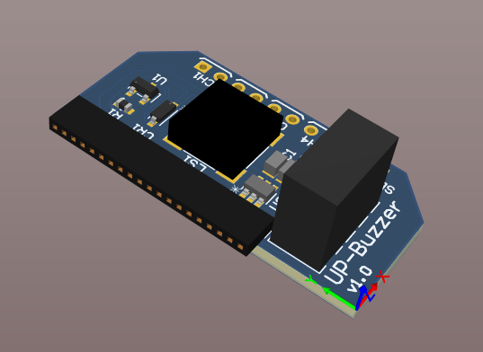
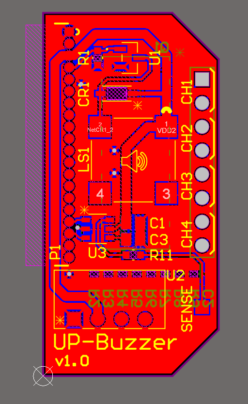
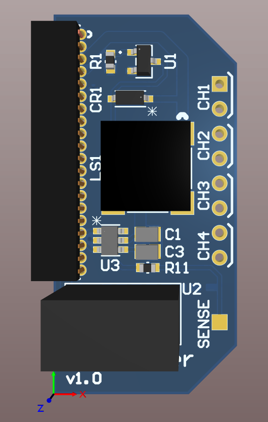

# Hardware

PCB to add capabilities for buzzing, proximity sensor and binary inputs. The project is based on Altium Designer and can be found in [project](project/)

## 3D rendering

## Production Package

In case you just want to order the PCB, feel free to use the files in the [production package](production_package/).