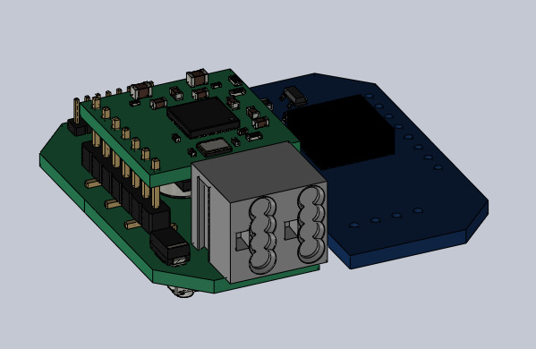
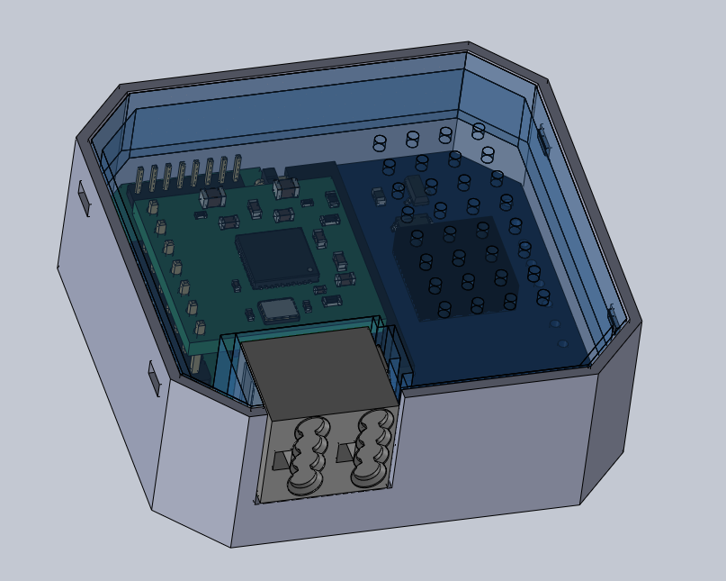
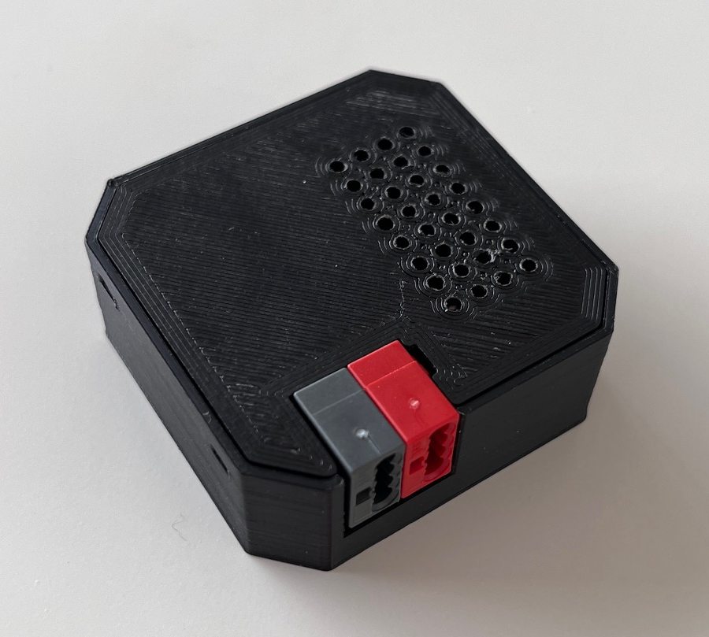

# 🏠 Housing

The housing for the UP-Buzzer is designed to be robust and compact, making it suitable for standard installations.

## Overview

The housing is designed to fit the necessary PCBs securely. Below is an image of the PCB arrangement:

## Model

The housing consists of two parts:
- **Top Shell**
- **Main Housing**

You can find the 3D model files in the [parts](parts/) directory. The assembly combining all PCBs is available in the [assembly](assembly/) directory.

Here’s a rendering of the 3D model with a transparent top shell:

## Exported STL Files for Printing

If you’d like to print the housing as-is, the ready-to-use STL files are available in the [print_package](print_package/) directory.

## Result

Below is the final printed result:

