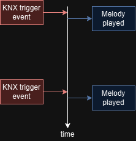
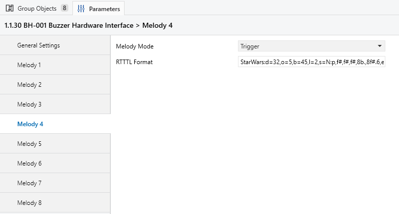
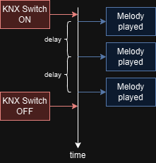
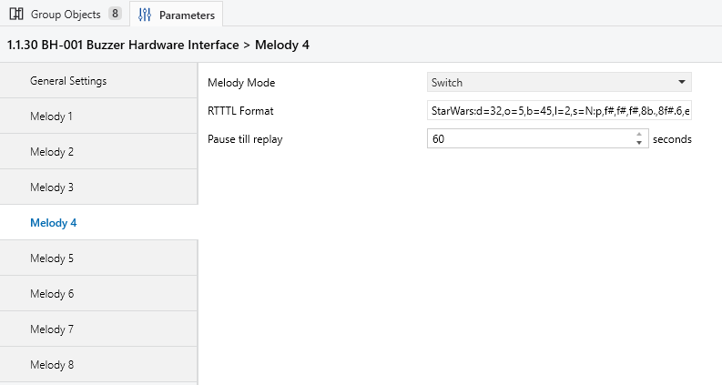
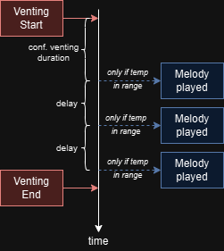
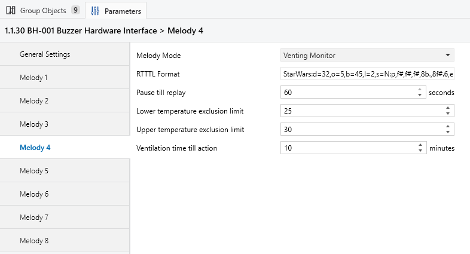

# 🛠️ Software

The UP-Buzzer project integrates seamlessly with **ETS**, primarily tested with **ETS 6.6**. However, the project can be adapted to work with older ETS versions if required.

## Usage

If you do not want to modify the product database and the ETS version matches, it is recommended to simply load the [existing product database](productdatabase/) into ETS.
Once loaded it can be used as you would use any other vendor product.

The melody definitions are based on [RTTTL](https://en.wikipedia.org/wiki/Ring_Tone_Text_Transfer_Language).

Currently, there are up to 8 melodies available, and each can be configured with one of three modes, as described below.

**Note**: Currently, no priority system is implemented, meaning that one melody can interrupt another while it's playing. However, adding a priority strategy is simple and can be done by extending the application.

---

### Trigger

This is the simplest mode. When a trigger telegram with a value of `1` is received, the melody will play once. If the trigger telegram has a value of `0`, it will be ignored, and no action will be taken.

**Configuration**

---

### Switch

In this mode, when the Group Object receives a "start" command, the melody will play continuously. The melody will keep playing until a "stop" command is received, at which point it will stop.

**Configuration**

---

### Venting Monitor

This mode allows you to set an upper and lower temperature threshold. The venting monitor is **disabled** when the temperature is within this range, helping to avoid unnecessary alerts.

This feature is particularly useful in scenarios like extreme summer heat or winter conditions when ventilation may not be exceeded. 

**Configuration Requirements**:
- Connect the external temperature sensor Group Object.
- Connect the window/door contact sensor Group Object.

Once the window is opened, the ventilation timer starts. If the window remains open, the ventilation timer will restart automatically once the timeout is reached. This process ensures that even if the outdoor temperature drops outside the defined range at a later point in time, the alert will still trigger. Until the window is closed or the temperature thresholds are back in range, the melody will be played.

## Tools

To create the KNX product database and provide full flexibility, this project uses:

- **[Kaenx-Creator](https://github.com/OpenKNX/Kaenx-Creator)**: A versatile tool for generating KNX product databases.

### Recommended Version

Kaenx-Creator is under active development, and updates can sometimes introduce breaking changes. For this project, it is recommended to use **[v1.8.4](https://github.com/OpenKNX/Kaenx-Creator/tree/v1.8.4)** to ensure compatibility.

- **Binary Download**: [Kaenx Creator v1.8.4](https://github.com/OpenKNX/Kaenx-Creator/releases/download/v1.8.4/Kaenx.Creator.Binaries.zip)
- **MD5 Hash**: `9aeb971f7844eeafb54341031f3e4ef8`

## Generation

To modify or recreate the product database:

1. Open the file `up-buzzer.ae-manu`.
2. Make any necessary changes and increase the version number.
3. Re-deploy the database.

The generated outputs include:

- **`knxprod.h`**: Move this file to [firmware/src/drivers/knx/data/](firmware/src/drivers/knx/data/).

### Note

During re-deployment, the program may become temporarily unresponsive. Allow it some time, as it will eventually complete successfully.